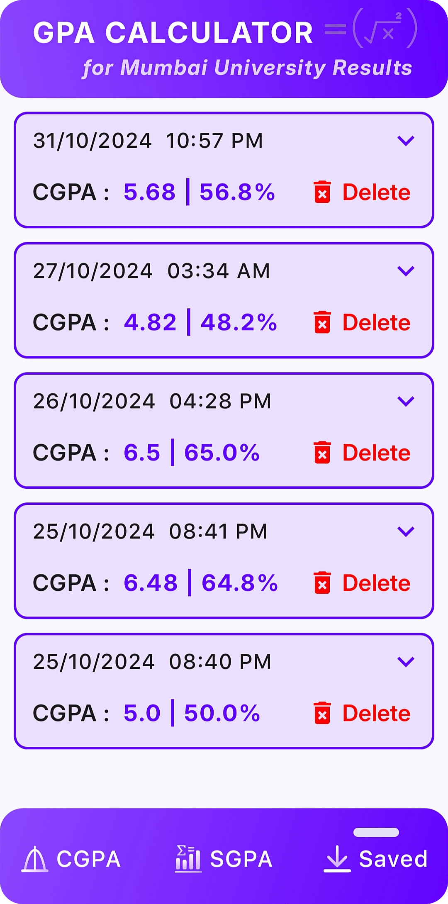

# MU GPA Calculator Android App

| &nbsp;App Logo &nbsp; | &nbsp; MU = 'Mumbai University'

    

  

A GPA calculator Android app to calculate gpa based on Mumbai University Results.
- Easy to use & modern UI design.
- Calculate the CGPA, SGPA by entering the values.
- View Bar Graph Chart for better visualization of data.
- Save the calculated results and view it anytime.
 

<b> Download & test the App in your phone ⬇️</b>  
https://github.com/ayushpadlekar/Gpa_Calculator_Mumbai_University/releases/tag/v0.0.1

<b> Checkout Design & Prototype on Figma 🖌️</b>  
https://www.figma.com/design/RAAQFzvuHiHZ28Hrnf6kye/CGPA-Calculator-for-MU-Results?node-id=0-1&t=Dnb944nrftSn7qNt-1

 

## Screenshots 📸

CGPA Screen &nbsp;|&nbsp; CGPA Screen with Input & Results &nbsp;|&nbsp; Saved Screen &nbsp;|&nbsp; SGPA Screen

  
    &nbsp;
  
    &nbsp;
  
    &nbsp;
  

 

## Utilized Technologies 🛠️

 - **Programming :** Jetpack Compose & Kotlin

 - **Architecture & Database :**
   
   - **MVVM Pattern** for a clean separation of UI and data handling.
   - **Dagger Hilt** dependency injection for efficient dependency management.
   - **Live-Data** used to update the UI based on the database state.
   - **View-Model** to handle UI related data and maintain state across configuration changes.
   - **Room** Database for local data storage and retrieval.

 - **Development Tools :** Android Studio, Figma, Github

 

## Features 💡

1. **User Interface**
    - Intuitive design with Material3 components for a modern look.
    - Thematic Colors, Fonts & Backgrounds.
    - Bottom Navigation Bar for seamless navigation between CGPA, SGPA, and Saved screens.

2. **CGPA Calculation**
    - Input fields for 8 semesters with validation for decimal values from 1.00 to 10.00.
    - 'Calculate' button computes the CGPA and displays result along with the percentage.
    - 'Reset' button to clear all entered values for a fresh start.

3. **Bar Graph Chart**
    - Integrated Bar Graph chart to visually represent semester-wise SGPA values.
    - To provide users with clear insights into their academic progress over time.

4. **Saving and Viewing Results**
    - Save calculated CGPA with timestamp for record-keeping.
    - Expandable cards in LazyColumn for detailed semester scores and calculated results.

 

## Demonstration 📲

https://github.com/user-attachments/assets/16ab6b86-8b41-41cb-a145-d2f303678418

 
